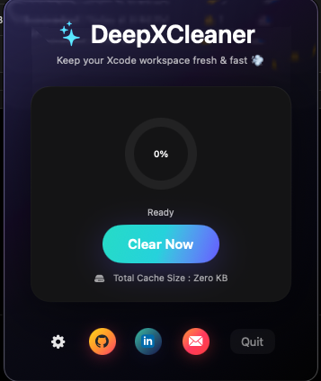

# DeepXCleaner – The Most Beautiful Xcode Cleaner for macOS 🚀

<p align="center">
  
  
  
  
</p>

<p align="center">
  ⚡ A sleek, modern, beautifully animated macOS menu bar app that deeply cleans Xcode's unwanted files — freeing up gigabytes in a single click.
</p>

<p align="center">
  <a href="https://github.com/Viswa7893/DeepXCleaner/releases/latest/download/DeepXCleaner.dmg">
    
  </a>
</p>


---

## ✨ Features at a Glance

### 🧹 One-Click Deep Cleaning

DeepXCleaner can remove:

- **Derived Data**
- **Archives**
- **Xcode Cache**
- **Carthage Cache**
- **Simulator Data**
- **Device Support** (iOS / tvOS / watchOS)
- **Old / Unavailable simulators**
- **Reset Xcode Preferences**

### 🌈 Modern macOS UI

- Smooth SwiftUI animations
- Glass-morphism cards
- Gradient buttons
- Hover effects
- Status progress
- Dark mode perfection

### 📊 Real-Time Storage Monitoring

- Live Xcode storage usage
- Automatic data refresh every 3 seconds
- Shows total bytes freed

### 🖥️ Menu Bar App

- Clean from anywhere
- Optional: show free space value in menu bar
- Opens a window with a clean modern UI

### ⚙️ Customizable Preferences

Choose exactly what gets cleaned.

---

## 🖼️ Screenshots

> Add images inside the `screenshots/` folder

<p align="center">
  
  <br/><br/>
  
</p>

---

## 💡 Why DeepXCleaner?

Xcode can generate **50–200GB** of leftover junk over time:

- Simulator runtimes
- Old device support folders
- Derived data bloating
- Multiple archive histories
- Cache files

**DeepXCleaner** cleans all of them safely and beautifully. No terminal. No manual searching. No scripts required.

---

## 🚀 Getting Started

### Requirements

- macOS 13.0 or later
- Swift 5.9+
- Xcode 15.0+

### Installation

1. Clone the repository:
   ```bash
   git clone https://github.com/yourusername/DeepXCleaner.git
   ```

2. Open `DeepXCleaner.xcodeproj` in Xcode

3. Build and run the project (⌘R)

---

## 🛠️ Usage

1. Launch DeepXCleaner from your Applications folder
2. The app icon will appear in your menu bar
3. Click the icon to open the cleaning interface
4. Select the items you want to clean
5. Click "Clean Now" and watch the magic happen!

---

## 📝 License

This project is licensed under the MIT License - see the [LICENSE](LICENSE) file for details.

---

## 🤝 Contributing

Contributions, issues, and feature requests are welcome!

---

## 💖 Support

If you found DeepXCleaner helpful, please consider:

- ⭐ Starring the repository
- 🐛 Reporting bugs
- 💡 Suggesting new features
- 📢 Sharing with other developers

---

## 👨‍💻 Author

**Durga Viswanadh Nemala**

- GitHub: [@DurgaViswanadh](https://github.com/Viswa7893)
- Linked IN: [@DurgaViswanadhNemala](https://www.linkedin.com/in/nemala-durga-viswanadh/)

---

<p align="center">
  Made with ❤️ for the iOS/macOS development community
</p>
